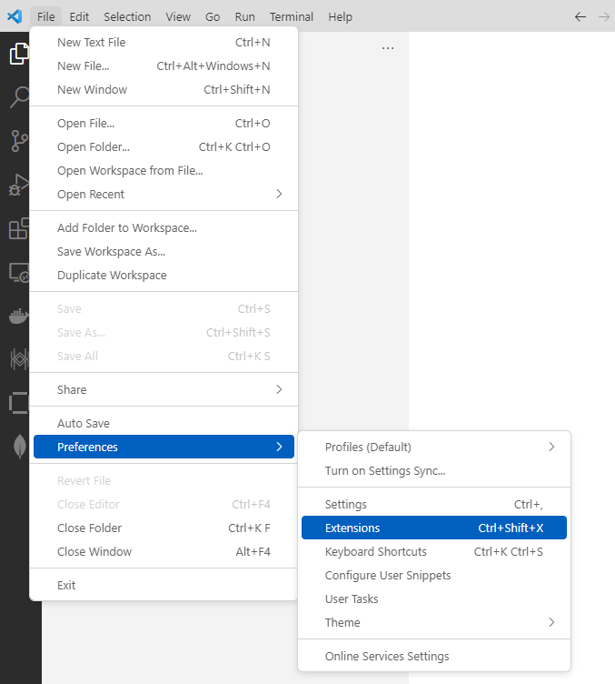
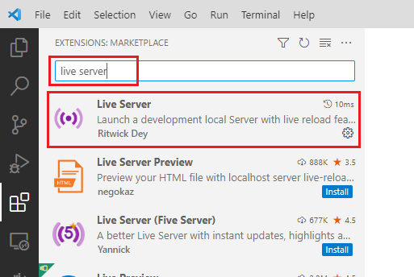
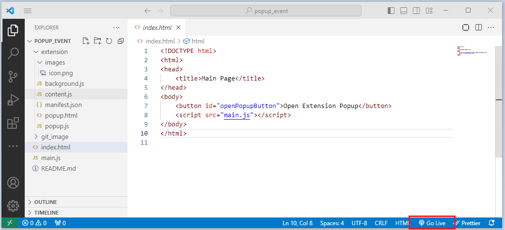
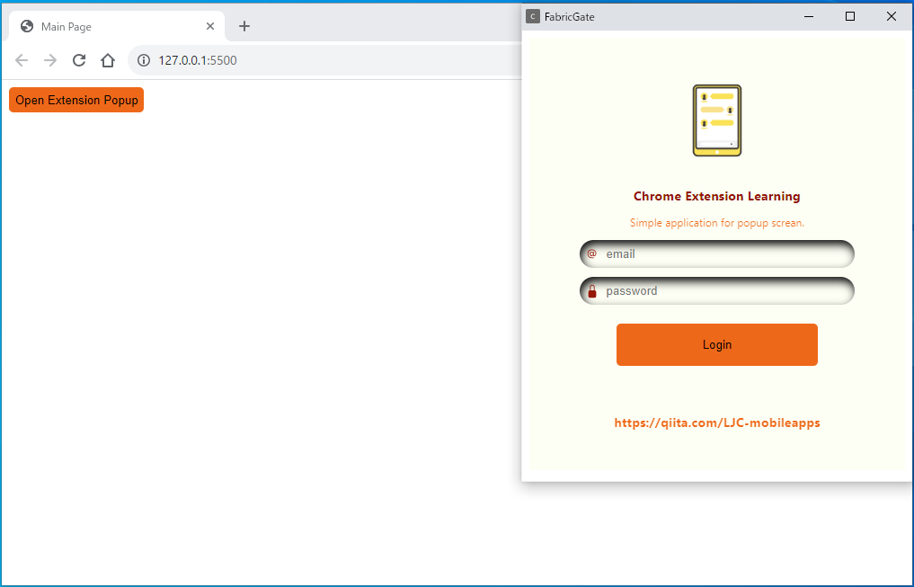

# Example Code for Learning Google Chrome Extension apps (simple Popup)
This is a very simple code to call the Chrome extension's popup screen from a button event on the main screen.

## Required tools and libraries.
* Google Chrome
* Microsoft Visual Studio Code
* Live Server for Visual Studio Code Extension

## Execution method.
1. Launch Visual Studio Code, run Live Server, and then open **index.html** in the browser.
2. Launch Google Chrome and add the 'extension' directory as a Chrome extension.
3. When you click the 'Open Extension Popup' button in index.html, a popup screen is displayed.

### About the Installation of Live Server.
1. Click on 'Extension' from the menu.

2. search for 'LiveServer,' and install it.

3. When you click 'Go Live' at the bottom of the screen, a web server will start.

### About the Installation of the simple Popup app to Chrome extension.
1. Launch Google Chrome.
2. In the Chrome address bar, type chrome://extensions/ and press Enter. This will open the Chrome Extensions page.
3. Make sure the "Developer mode" toggle switch, usually located in the upper-right corner, is turned on. This enables you to load unpacked extensions.
4. Click on the "Load unpacked" button.
5. In the file dialog that appears, navigate to and select the "extension" directory that contains your Chrome extension files.
6. Click the "Open" or "Select Folder" button to add the extension to Chrome.

## Popup image.

[Animation popUp](./git_image/LJC-mobileapps.gif)
